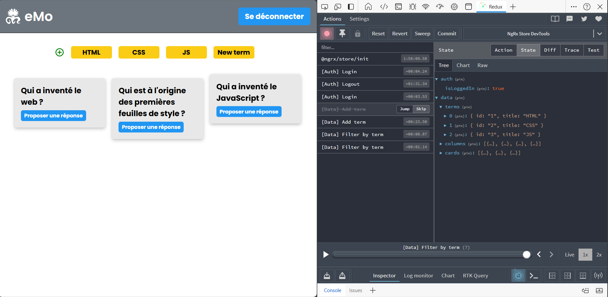
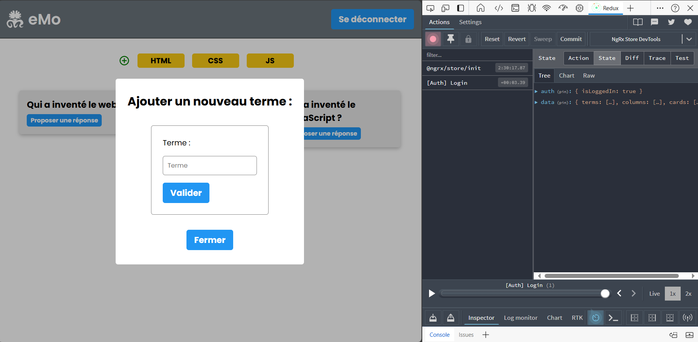

# Memopus

Simple State Management application with NgRx Store.

This is a basic example of implementing state management using NgRx Store in an Angular application. The application utilizes Angular version 17.3.0 and NgRx Store version 17.2.0.

### Running the Application :

1. Install Dependencies: Navigate to the project's root directory and run `npm install --legacy-peer-deps` to ensure compatibility between Angular 18 and Ngrx Store 17 and install all required dependencies.

2. Start JSON Server: Run `npm run dev` to launch the JSON server, which likely provides mock data.

3. Launch the Application: Execute `ng serve` to start the Angular application in your browser.

4. Login credentials : 
    - Identifiant : admin
    - Password : admin

# Participants : 

- [Elsa Thiévet](https://github.com/3l5a)
- [Romain Mornet](https://github.com/roro3164)
- [Mohamed Zaoui](https://github.com/devbymoz)
- [Lidia Hernandez](https://github.com/Pulga21)
- [Rachid Amrani Alaoui](http://github.com/rachidamrani)